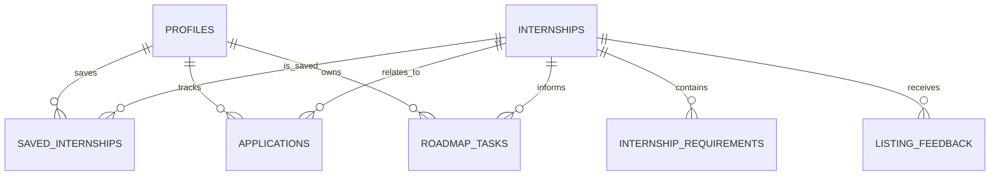

# InternX — Proposed Database Schema

**Status:** Design proposal. This is not a claim that these tables or migrations already exist.

## Design rules

- Give each entity a stable primary key.
- Use foreign keys for relationships.
- Store dates/timestamps with appropriate database types.
- Distinguish a missing value from an empty or false value.
- Preserve opportunity source and freshness metadata.
- Protect user-owned records with Row Level Security (RLS).
- Do not place secrets in database records intended for the browser.

## Proposed tables

### `internships`

Opportunity details:

- `id` — primary key
- `title`, `organization`, `field`
- `description`, `responsibilities`
- `location`, `work_mode`, `duration`
- `stipend` — nullable, with currency/unit represented unambiguously
- `deadline` — nullable
- `deadline_type` — confirmed, expected-unconfirmed, or unknown as appropriate
- `status` — open, upcoming-confirmed, expected-unconfirmed, date-unknown, closed, or needs-recheck
- `required_documents`, `selection_stages` — structured fields if used
- `source_url` — canonical official or otherwise permitted source
- `source_checked_at` — nullable timestamp
- `data_origin` — curated, imported-with-permission, or demo
- `created_at`, `updated_at`

### `internship_requirements`

Recommended normalized representation for requirement-level evidence:

- `id` — primary key
- `internship_id` — foreign key
- `requirement_text`
- `requirement_type` — mandatory or preferred
- `category` — skill, education, experience, document, location, or other
- `source_excerpt` — nullable excerpt supporting the requirement
- `created_at`, `updated_at`

### `profiles`

- `user_id` — linked to the authenticated user when applicable
- `course`, `academic_year`, `graduation_year`
- `experience` — structured data or a related table
- `interests`, `preferred_location`, `preferred_work_mode`
- `preferred_duration`, `availability`, `stipend_preference`
- `created_at`, `updated_at`

### `profile_skills` (optional normalized table)

- `id`
- `user_id`
- `skill_name`
- `experience_level` — nullable and defined consistently
- `evidence_note` — optional, user-provided

### `saved_internships`

- `id`
- `user_id`
- `internship_id`
- `saved_at`

Add a uniqueness constraint so a user cannot accidentally create duplicate saves for the same internship.

### `applications`

- `id`
- `user_id`
- `internship_id`
- `stage`
- `next_action`
- `deadline` — optional user-entered date, clearly distinguished from sourced deadline data if both are stored
- `notes`
- `outcome`
- `created_at`, `updated_at`

### `roadmap_tasks`

- `id`
- `user_id`
- `internship_id` — nullable only if general tasks are allowed
- `title`, `description`, `reason`
- `priority`
- `status`
- `due_date` — optional
- `created_at`, `updated_at`

### `listing_feedback`

- `id`
- `internship_id`
- `user_id` — optional depending on feedback policy
- `category`
- `description` — optional
- `created_at`
- `review_status` — if a moderation workflow is implemented

## Relationships

The profile-to-user relationship may be implemented with a separate user identity model depending on the final Supabase schema.

## RLS and permissions

- A user can select/update their own profile only.
- A user can manage only their own saved internships, applications, and roadmap tasks.
- Public read access to internships should be allowed only for fields intended for publication and only where publication rights permit it.
- Listing feedback access should follow a deliberate policy; avoid exposing reporter identity or private descriptions unnecessarily.
- Administrative listing updates should use controlled server-side or authenticated privileged workflows, not a service-role key in the browser.

## Indexes to consider

- `internships(status, deadline)`
- `internships(field, work_mode)`
- `internship_requirements(internship_id, requirement_type)`
- `saved_internships(user_id, internship_id)`
- `applications(user_id, stage)`
- `roadmap_tasks(user_id, status, due_date)`

Confirm indexes against real query patterns before adding them.

## Data migration guidance

Create version-controlled SQL migrations. Test RLS policies using at least two separate users and confirm that one user cannot read or modify another user's private records. Keep demo records distinct from real sourced records.
