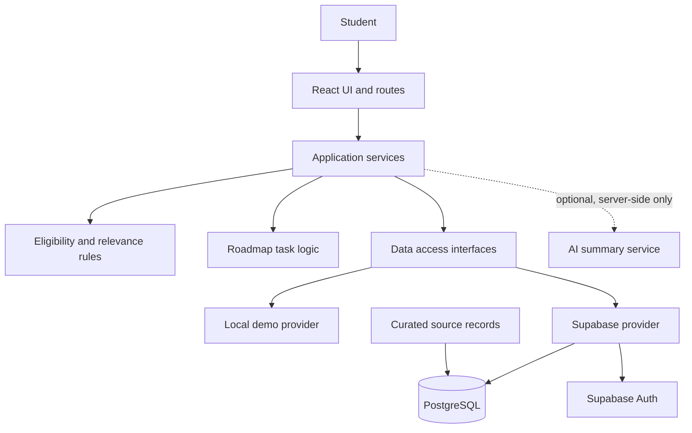

# InternX — Technical Architecture

**Status:** Proposed architecture. Keep this document aligned with the implemented code.

## 1. Architecture goals

- Build the smallest end-to-end workflow that can be demonstrated reliably.
- Keep eligibility and ranking rules testable outside the UI.
- Separate data access from visual components.
- Support local demo mode without pretending it is production authentication.
- Protect student-owned data and preserve source provenance.
- Make optional AI functionality replaceable and non-blocking.

## 2. Proposed stack

- React + Vite + TypeScript
- Tailwind CSS
- React Router
- Lucide React
- Supabase Auth and PostgreSQL, when configured
- Vercel or equivalent hosting
- Optional server-side AI integration after the MVP works

## 3. Logical architecture

The diagram is conceptual; it does not prove these modules are implemented.

## 4. Application layers

### Presentation

Pages, layouts, forms, navigation, reusable cards, dashboards, boards, and status components. UI components should not contain the authoritative eligibility algorithm.

### Domain logic

Typed functions for:

- Requirement classification and evaluation
- Relevance scoring
- Recommendation explanations
- Roadmap task generation
- Application stage transitions
- Listing status presentation

These functions should be unit-testable without a browser or database.

### Data-access layer

Provide consistent operations for profiles, listings, saved internships, applications, roadmap tasks, and feedback. The UI should use the data interface rather than directly coupling every component to Supabase calls.

A demo provider and Supabase provider may implement the same interfaces. Switching providers must be explicit and predictable.

### Persistence and authentication

Supabase can provide authentication and PostgreSQL storage. Apply database RLS policies for private records. Demo storage is for demonstration only and must not be described as equivalent to production account security.

### Opportunity sourcing

Begin with a small, curated dataset. Keep canonical source URLs and check dates. Use automated imports only where permitted and after appropriate validation.

### Optional AI service

If added, call it from a trusted server-side boundary. Validate outputs and keep eligibility decisions rules-based. AI must not invent missing dates, requirements, or employer instructions.

## 5. Proposed route map

| Route | Purpose |
|---|---|
| `/` | Public landing page |
| `/signup` | Create an account |
| `/login` | Sign in or enter demo mode |
| `/forgot-password` | Password reset flow, if authentication is enabled |
| `/onboarding` | Student profile setup |
| `/dashboard` | Personalized overview |
| `/internships` | Search and filter opportunities |
| `/internships/:id` | Opportunity details and eligibility |
| `/roadmap` | Preparation task management |
| `/applications` | Application pipeline and list |
| `/profile` | Edit profile and preferences |
| `/settings` | Account, privacy, and feedback options |

Change this map if the actual router differs.

## 6. Core data flow

1. User profile and preferences are loaded from the chosen provider.
2. Listing data is loaded with source and status metadata.
3. Search and filters narrow the opportunity set.
4. Domain functions evaluate documented mandatory requirements.
5. Relevance ranking orders opportunities separately from eligibility decisions.
6. The UI displays explanations and unknown states.
7. User-saved roles, tasks, and tracker stages are written to the provider.
8. Errors are surfaced to the user; failed production persistence must not silently appear successful.

## 7. Configuration

Frontend environment variables should contain only values designed to be public in the browser, such as the Supabase URL and anon/publishable key. Never use a service-role key in a `VITE_` variable.

## 8. Reliability and failure behavior

- Provide loading, error, and empty states for asynchronous operations.
- Do not confuse a failed network request with an empty listing set.
- Do not silently swap production data for demo data after errors.
- If source content cannot be checked, use an honest status such as Needs recheck.
- If a requirement cannot be evaluated, return Needs confirmation.

## 9. Performance

Start with indexed database queries and sensible pagination if listing volume grows. Avoid repeated network requests caused by unnecessary component renders. Do not add caching or background jobs unless there is a clear requirement and a safe invalidation strategy.

## 10. Testing strategy

- Unit tests for eligibility and scoring logic.
- Tests for missing and ambiguous requirements.
- Integration tests for data-provider operations where practical.
- End-to-end checks for the core user journey.
- Manual responsive and accessibility checks.
